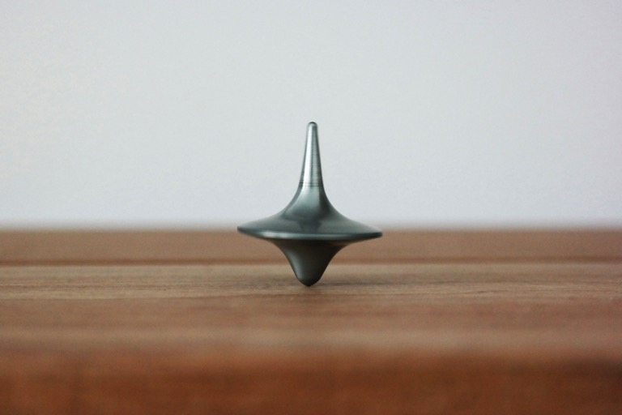

## About this series

I intend for this to be a long-running series that really just describes my life. I have been fortunate to have gained a few widely differing skills, but like many others can relate, rarely feel as if I can handle it all as just one person. Entering into the tech industry has been the second biggest challenge of my life and even after over a year, I am only just now feeling an ounce of ease in my new occupation.

### So, how did we get here?

Rewind back to 2020. While the world began to fall apart from the Covid-19 pandemic, I was blissfully unaware that March as I circumnavigated around Australia as a saxophonist on the M/S Radiance of the Seas. I had come back to cruise ship work after leaving the US, while my wife, Abi moved our things back to her home in the UK to help prepare for my immigration. So you can imagine the confusion when we made it back to Sydney, disembarked all of our guests, and were promptly told to leave port. Long story short, we spent two months at sea with no flights home, a ship full of booze, and plenty of solitary quarantine time to enjoy it all.

### A New Home

When I (eventually) flew home via Manila, the UK was just entering lockdown. I was fortunate to have been allowed in (as a US citizen, I had a Visa Waiver) and went to stay with my wife and in-laws. I couldn't work, even if the lockdown lifted, so I did the next best thing: educated myself. I finished an online Digital Marketing Certificate and taught myself electronic music production while sat in my little sister-in-law's bedroom while my wife did call center work. While still in a reduced lockdown, we managed to buy a flat nearby and moved in April 2021.

### Getting to Work

I love creative work that challenges me mentally. So when I find something I'm interested in, I really lose myself in it and can spend hours upon hours digesting info and experimenting and learning. I was hammering away at making "beats" and learning audio production day and night; not making any income from it yet, but enjoying it.

> Check out a bit of what I did:
>
> * [https://drive.google.com/file/d/1flDmAoLqq9CnlQh8XZDC7NoktAV7lpfw/view?usp=drive_link](EWI - An Electronic 'Saxophone')
> * [https://www.youtube.com/watch?v=DW4AEC8Eodg](Ain't Nobody - DMAC Remix)
> * [https://on.soundcloud.com/d1yeyAuskHjhzQcs70](Cat Rat Dog - DMAC)
