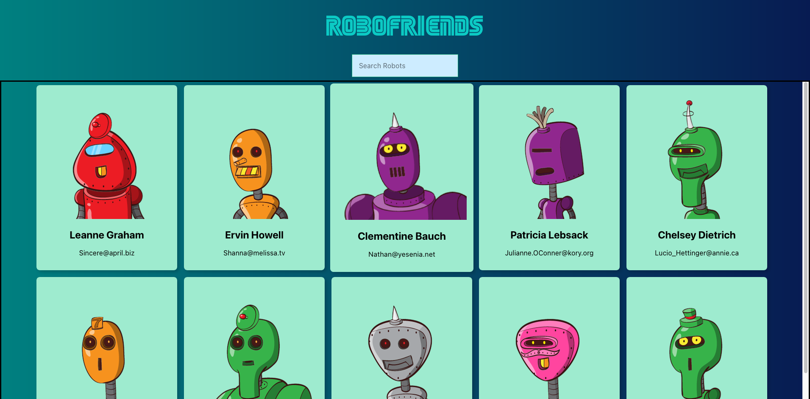

# Robofriends

**Description:** A React project that searches through a list of robots generated from the RoboHash API.

**Publish Date:** March 26 2024

**Project Overview:**

Robofriends is a React project that searches through a list of robots generated from the RoboHash API. Users can filter the robots by name and see their details, such as email address. The project demonstrates the use of React components, state management, and API integration.

[See the live project here](https://dmcdaniel90.github.io/robofriends/)

[See the Github repo here](https://github.com/dmcdaniel90/robofriends)

## Objectives

1. Learn the basics of React, including components, props, and state.
2. Practice fetching data from an API and displaying it in a React application.
3. Integrate state management using Redux for better data flow and performance.
4. Implement basic type safety using TypeScript to prevent runtime errors and improve code quality.
5. Create a testing strategy using Jest and React Testing Library to ensure the application works as expected.

## Features

1. **Dynamic Searching**
   - Users can search for robots by typing in the search field and see the results update in real-time.
   - The search is case-insensitive and matches any part of the robot's name.

2. **Error Handling**
   - If there is an error fetching the robots from the API, an error message is displayed to the user, without breaking the application.

3. **Progressive Web Application**
   - The application is built using modern web technologies and follows best practices for performance and accessibility.
   - Users can install the application on their device and use it offline.

## Technology Stack

- **Frontend:** React for building the user interface and Redux for state management.
- **API:** [RoboHash API](https://robohash.org/) for generating robot images based on text.

## Outcome

Robofriends was my first complete React project and it helped me understand the core concepts of React, such as components, props, and state. I learned how to manage the application's state using Redux and how to fetch data from an API. The project also introduced me to TypeScript and testing in React applications.
